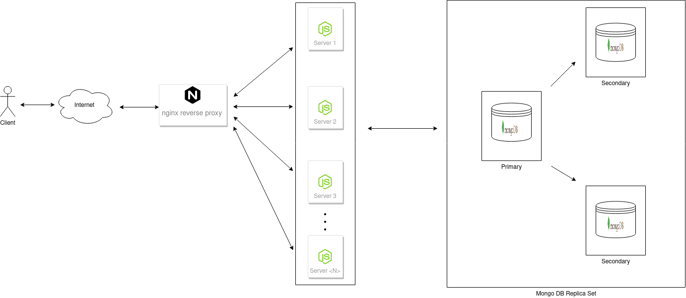

# Horizontal scaling a REST API with Node.js, MongoDB and docker-compose
A sample system demonstrating a highly scalable and fault tolerant application that implements a REST API for product ordering, by leveraging `node.js`, `mongoDB` replica sets and `nginx` as a load balancer, wrapped with `docker-compose`. 

## Architecture


The system consists of 3 layers, all running within docker containers and being managed by `docker-compose` as follows:
* Node.js - Spawns a server that listens for incoming requests and serves a sample REST API; It can scale from 1 to many instances, depending on the load expected for increasing the system's capacity on delivering requests;
* nginx - Acts as a reverse proxy and a load balancer towards the available Node.js servers. It uses its built-in mechanism for load balancing the requests to each available server, allowing the system to run efficiently.
* MongoDB - The persistence layer consists of a MongoDB replica set with 1 primary node and 2 secondaries, which can add failover handling and backup advantages to the system.

## Folder structure
* /deploy - Contains all the different parts required to build and deploy the application with `docker-compose`.
    - /deploy/api/src - Contains the source code of the Node.js servers, among with the REST API.
    - /deploy/db - Contains the required scripts for setting up a MongoDB replica set.
    - /deploy/nginx - Contains the required configuration for the nginx load balancer.
* /test - Contains the automated E2E suite that tests all the functionalities of the REST API.    

## Running
##### Prerequisites
  * docker v19.03.8 - https://docs.docker.com/get-docker/
  * docker-compose v1.27.0 - https://docs.docker.com/compose/install/
      
##### Steps
###### Automated
* Just run the provided shell script:
    ```
    sh ./deploy.sh
    ```     
###### Manually  
* Change the working directory to `deploy` folder.
* _(Optional)_ Modify the values of the required environmental variables via the provided `.env` file. 
* First build the required docker images with:
    ```
    docker-compose build
    ```

* Then bring up the containers with:
    ```
    docker-compose up
    ``` 

    *Notes*: 
    - ***Scaling:*** In order to scale the node.js servers, you can optionally append the flag `--scale api-node=<NUMBER OF INSTANCES>`, e.g. for a total of 5 instances use: 
        ```
        docker-compose up --scale api-node=5
        ```
* Wait until all the containers have started, usually takes about 20 seconds, but it depends on the resources of the host machine. After that the server should be accessible in port `80` of your local machine.
## Testing
#### Automated Testing
There is a set of E2E tests using Jest, that test all the functionalities of the REST API.

In order to run the tests follow these steps:
###### Automated
* Just run the provided shell script:
    ```
    sh ./test.sh
    ```     
###### Manually
* Make sure that you have deployed the application and it is running as described in [Running](#running) section.
* Change the working directory to `test` folder:
* Install the required `node.js` modules by running:
    ```
    npm install
    ``` 
* Execute the tests by running:
    ```
    npm run test
    ``` 
#### Manual Testing & REST API Documentation
The provided REST API has been documented using Swagger and it exposes the available documentation and a testing UI framework that can send HTTP requests, via [http://localhost/api/docs](http://localhost/api/docs).
